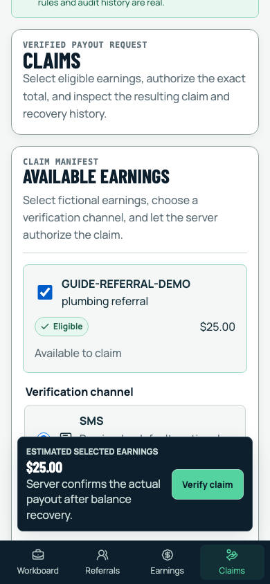
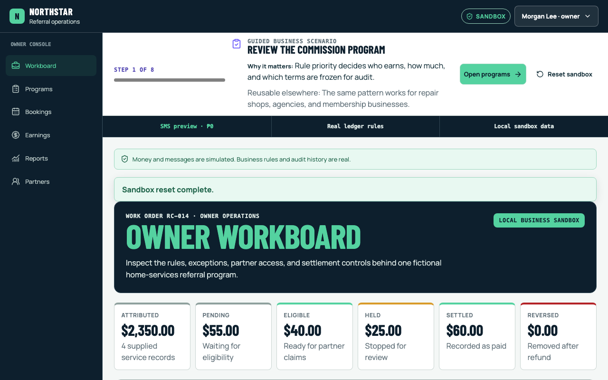
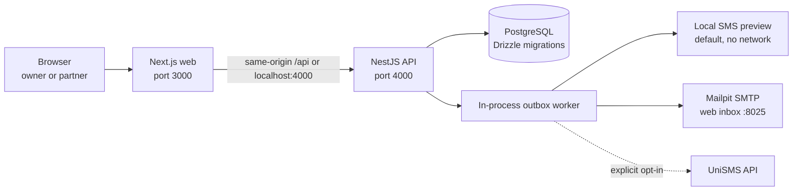

# Referral Commission Sandbox

[](https://github.com/Eloe321/Refferral-Commission-System/actions/workflows/ci.yml)

A mobile-first, local business sandbox for exploring referral attribution, commission rules, OTP-authorized claims, simulated payouts, refunds, and recovery. The sample company and every record are fictional. No signup, paid SMS account, or payment provider is required for the default experience.

## Live sandbox

Open the [public sandbox](https://referral-commission-system.pages.dev) or its [API health check](https://refferral-commission-system-production.up.railway.app/health). The public instance is a shared, resettable demonstration with fictional data and simulated money movement.

## What the sandbox demonstrates

The sandbox lets a business owner and a referral partner inspect the same lifecycle from different permissions:

- An owner reviews flat, percentage, category, and partner-specific commission rules.
- A referral code connects a partner to a fictional service order.
- Line-item earnings stay pending until the service qualifies, then become eligible.
- Owners can hold, release, or void unpaid earnings without deleting history.
- Partners select eligible earnings and authorize a claim with a short-lived OTP.
- Payouts are simulated, while ledger and audit records behave like accountable financial operations.
- Refunds preserve the original payout and append a negative recovery entry.
- A guided scenario explains how the same controls can fit other business models.

The web app uses Next.js. NestJS owns domain decisions. PostgreSQL stores the local sandbox through Drizzle ORM. Mailpit captures email locally. SMS defaults to a free browser preview.

## Two-minute guided tour

You need Docker Desktop or Docker Engine with the Compose plugin.

1. Start the complete stack:

   ```bash
   docker compose up --build -d
   ```

2. Open [http://localhost:3000](http://localhost:3000). The first screen creates a signed fictional owner session automatically.

3. Follow the guide in this order:

   1. Review the active program and rule priority.
   2. Switch to Jamie's partner workbench.
   3. Create the guided referral and complete the fictional service.
   4. Select the new eligible earning and choose SMS preview.
   5. Copy the six-digit code from the right-side drawer, paste it into the single OTP field, and create the claim.
   6. Return to the owner workbench, settle the simulated claim, and issue a partial refund.
   7. Inspect the immutable payout and negative reversal, then complete the guide.

The **Reset sandbox** action restores the deterministic records and rotates the signed session. It affects only the fictional local tenant.

### Workbench pages

The sandbox uses real, deep-linkable pages instead of one scrolling dashboard:

- Owner: `/owner/workboard`, `/owner/programs`, `/owner/earnings`, `/owner/partners`.
- Partner: `/partner/workboard`, `/partner/referrals`, `/partner/earnings`, `/partner/claims`.

The signed sandbox persona follows the role prefix. The shared guide and fictional workspace remain active while navigating, including browser back, forward, and refresh.

## Mobile-first screenshots

The same work-order interface changes from stacked phone controls to a wider owner workboard without changing the business vocabulary.

### Partner claim at 390 by 844



### Owner dashboard at 1280 by 800



Both views are exercised at browser level. The suite also checks the 320-pixel layout, 44-pixel touch targets, keyboard focus, dialog focus trapping and restoration, live announcements, reduced motion, status labels, and OTP visibility.

## Architecture diagram



The API is authoritative for rule selection, exact money arithmetic, lifecycle transitions, OTP generation, claim binding, permissions, and idempotency. The browser renders typed read models and sends commands; it does not decide whether money is earned or claimable.

Repository layout:

```text
apps/web/             Next.js workboard and guided scenario
apps/api/             NestJS routes, domain services, and delivery worker
packages/contracts/   Shared Zod request and response contracts
packages/database/    Drizzle schema, migrations, and deterministic seed
packages/ui/          Accessible shared UI primitives
tests/e2e/            Real Chromium journeys and delivery isolation
docs/architecture/    Lifecycle, notification, and privacy explanations
```

Read the deeper references:

- [Domain lifecycle and recovery ledger](docs/architecture/domain-lifecycle.md)
- [Notification delivery](docs/architecture/notification-delivery.md)
- [Privacy boundary](docs/architecture/privacy-boundary.md)

## Commission rules and lifecycle

Rules resolve from most specific to least specific:

1. partner and category;
2. partner-wide;
3. program and category;
4. program default.

Within the same specificity, the newest effective rule wins, followed by a stable ID tie-break. Flat rules store a minor-unit amount. Percentage rules store integer basis points. All authoritative arithmetic uses `bigint`, and API money values cross JSON as decimal strings such as `{ "amountMinor": "2500", "currency": "USD" }`.

The selected rule is snapshotted on the earning. Later rule edits affect future earnings, not historical calculations. Service completion makes pending earnings eligible. Cancellation or no-show voids unpaid earnings. A hold records the operator, reason, and timestamps; release derives the correct state from the underlying conversion.

The owner booking page demonstrates a signed `service.completed` event moving a fictional booking's commission into eligibility. It records duplicate and failed events, shows retryable failures, and writes a system audit record for accepted completion. See [Booking completion events](docs/architecture/booking-events.md) for the payload, signature, and demo boundary.

The owner can create programs, assign partner referral codes, add flat or percentage rules by category or partner, and preview a commission using the server's rule selection. The earnings queue explains the selected rule and next action; the reports page shows status, reversal, and partner totals and exports exact minor-unit CSV. A [one-page case study](docs/portfolio/case-study.md), [architecture diagram](docs/portfolio/architecture.mmd), [walkthrough script](docs/portfolio/walkthrough.md), and [starter client offer](docs/portfolio/starter-offer.md) package the sandbox for review.

The current Compose stack is for local use. See [public sandbox deployment details](docs/portfolio/deployment-readiness.md) for the hosted demo and the safeguards required before adapting it to a real business.

A settled earning is never edited away after a refund. The API calculates the reversal from the original rule snapshot, appends a negative ledger entry, and applies the outstanding recovery against later claims. See [Domain lifecycle and recovery ledger](docs/architecture/domain-lifecycle.md) for transition tables and formulas.

## Free preview SMS is the default

`SMS_DELIVERY_MODE=preview` is the default Compose setting. It is available only in sandbox mode.

When a partner requests an SMS code:

- the API generates a six-digit code and stores only a challenge-bound HMAC digest;
- the current browser receives a one-time preview payload with a masked fictional recipient;
- the right-side drawer shows the message, code, and server-relative expiry;
- the notification row is immediately marked `previewed`, with masked recipient and no stored message content;
- no SMS provider request occurs and no SMS charge is possible.

Preview challenges still enforce the real claim controls: organization, actor, partner, selected earnings, exact server payout, currency, five-minute expiry, five attempts, and cooldowns.

## Mailpit email workflow

Email defaults to `EMAIL_DELIVERY_MODE=mailpit`. Mailpit captures SMTP messages inside Docker and does not deliver them to the public internet.

1. In the partner claim flow, choose **Email to local inbox** before creating a challenge.
2. Open [http://localhost:8025](http://localhost:8025).
3. Open **Your claim verification code**, copy the code, and return to the claim form.

The same outbox worker can use a configured SMTP server with `EMAIL_DELIVERY_MODE=smtp`. Set `EMAIL_DELIVERY_MODE=disabled` to make email unavailable. See [Notification delivery](docs/architecture/notification-delivery.md) for queue and failure behavior.

## Optional UniSMS opt-in

Live SMS is deliberately off. The server integration follows the official [UniSMS SMS API documentation](https://unismsapi.com/docs/sms): Basic Authentication, `POST /api/sms`, E.164 recipients, sender ID, message content, metadata, and provider reference tracking.

Use placeholders in committed files:

```dotenv
SMS_DELIVERY_MODE=unisms
UNISMS_API_KEY=replace_me
UNISMS_SENDER_ID=replace_me
UNISMS_WEBHOOK_SECRET=replace_me
```

Startup rejects `unisms` mode while the required API key or sender ID is missing or still `replace_me`. Supply real values only through your local environment or secret manager. Never commit them. Live mode omits the code and message from browser responses.

The optional webhook is `POST /webhooks/unisms`. Configure a non-placeholder webhook secret before exposing it. Local development and the browser suite do not require a public webhook.

## Docker operations and tests

### Start and inspect

```bash
docker compose up --build -d
node scripts/wait-for-health.mjs http://localhost:4000/health
docker compose ps
docker compose logs -f api web postgres mailpit
```

Services:

| Service    | Local address           | Purpose                             |
| ---------- | ----------------------- | ----------------------------------- |
| Web        | `http://localhost:3000` | Guided owner and partner workboards |
| API        | `http://localhost:4000` | Domain API and health endpoint      |
| Mailpit    | `http://localhost:8025` | Captured local email                |
| PostgreSQL | `localhost:5432`        | Local sandbox database              |

### Stop or reset

Stop containers while retaining the local database volume:

```bash
docker compose down
```

Remove the Compose database volume and rebuild the fictional sandbox from its canonical seed:

```bash
docker compose down --volumes
docker compose up --build -d
```

The API container applies migrations, verifies or inserts the deterministic seed, and then starts.

### Verify

Local package checks require Node.js 24.15 or newer in the Node 24 line and Corepack:

```bash
nvm use
corepack enable
pnpm install --frozen-lockfile
pnpm verify
```

The exact reviewed version is in [`.nvmrc`](.nvmrc). CI runs lint, type checks, unit, database integration and API E2E tests, the privacy scan, Chromium journeys, and both Docker builds on pushes and pull requests. Failed browser runs upload screenshots, traces, and an HTML report as a workflow artifact. Dependabot proposes package updates separately from feature work.

`pnpm verify` runs lint, type checks, unit and database tests, API E2E tests, the privacy scan, and real Chromium journeys. The browser command intentionally restarts this Compose project with preview SMS, so do not use it against an unrelated Compose project.

Useful focused commands:

```bash
pnpm test:unit
pnpm test:integration
pnpm test:api-e2e
pnpm privacy:check
pnpm test:e2e
node scripts/docker-smoke.mjs
```

Database integration tests use `DATABASE_URL_TEST`; point it at a freshly migrated disposable database when you need to preserve an existing local sandbox. API E2E and isolated delivery tests create uniquely named databases and remove them after the run. `scripts/docker-smoke.mjs` expects the Compose stack to be running and verifies the web page, preview SMS, absence of a UniSMS outbox row, and a Mailpit-captured email.

## Security and privacy boundaries

- Demo persona switching exists only when `APP_MODE=sandbox`; `/demo/*` returns 404 outside sandbox mode.
- Sessions are signed, HTTP-only, same-site cookies. A sandbox version is embedded in each session, so reset invalidates every older cookie.
- Owner operations, partner claim creation, and tenant filters are checked on the server.
- Composite organization foreign keys prevent cross-tenant relationships.
- OTP codes use cryptographic randomness, HMAC digests, constant-time comparison, expiry, attempts, and cooldowns.
- Mutations use tenant-scoped idempotency records and database locks.
- Audit events retain actor or system provenance, reason, aggregate type, related ID, and timestamp.
- Delivery rows redact recipient and content before each external attempt. A retryable pre-acceptance rejection restores them only while the row waits for its next bounded retry; ambiguous and terminal outcomes stay redacted.
- `pnpm privacy:check` scans tracked and pending files using neutral rules plus the optional local `.privacy-denylist.local` file.

All sample names, contacts, UUIDs, service orders, and money are fictional. Read [Privacy boundary](docs/architecture/privacy-boundary.md) before adapting the repository.

## Production limitations and non-goals

This repository demonstrates product and engineering patterns. It is not a deploy-ready payment system.

It does not provide:

- real payouts, bank transfers, wallets, or card movement;
- production authentication, account recovery, identity proofing, or KYC;
- tax reporting, invoicing, withholding, or regulatory workflows;
- fraud scoring or abuse operations;
- multi-level referrals or affiliate-network attribution;
- cross-site cookie attribution or marketing surveillance;
- production secret storage, deployment, backups, monitoring, or disaster recovery;
- a general multi-tenant onboarding flow;
- automatic currency conversion or organization-level multi-currency accounting.

Before production use, replace demo sessions and payout simulation, review the threat model, add real identity and authorization, define financial reconciliation, choose compliant providers, implement observability and backup procedures, and obtain legal and accounting review for the target market.

For changes and vulnerability reports, see [Contributing](CONTRIBUTING.md), [Security policy](SECURITY.md), and the [architecture decision log](docs/architecture/decisions/README.md).

## Adaptation examples

The engine models a qualifying business event, not one specific shipping or service workflow.

| Business      | Conversion                    | Eligibility gate                                  | Typical reversal                              |
| ------------- | ----------------------------- | ------------------------------------------------- | --------------------------------------------- |
| Services      | Completed job or paid invoice | Technician marks work complete                    | Partial service refund or cancellation        |
| Retail        | Referred order                | Payment captured and return window passed         | Return, chargeback, or order correction       |
| Appointments  | Referred booking              | Customer attends the appointment                  | No-show, cancellation, or refunded session    |
| Subscriptions | Referred subscription         | First invoice paid or retention milestone reached | Refund, failed payment, or early cancellation |
| Marketplaces  | Referred transaction          | Fulfillment and dispute window complete           | Seller refund, dispute, or corrected order    |

For each adaptation, keep the same safety properties: explicit rule priority, per-item earnings, immutable snapshots, server-owned eligibility, partner-bound claims, idempotent money transitions, append-only audit history, and negative recovery rather than rewriting a settled payout.
